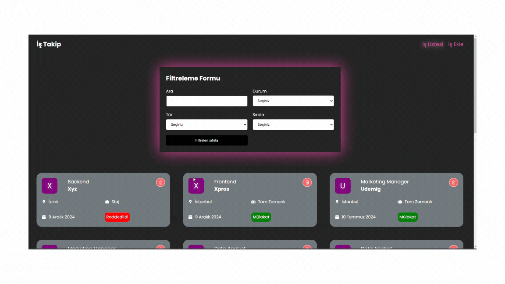

# 📝 Job Tracking List Application

This project is a **Job Tracking List** Application where users can manage their job applications effectively. It offers features like adding, deleting, and searching/filtering job applications based on specific criteria.

---

## 📋 ** Project Details**

 <h1>Create and manage a job tracking list by entering the following details:</h1>

- **Position**
- **Company Name**
- **Location**
- **Status** Interview, In Progress, Rejected
- **Work Type** Full-time, Part-time, Remote, Internship

---

## 💡 **Application Features:**

- **Add new job applications**

- **Delete existing applications**

- **Search and filter applications based on entered criteria**

- **A user-friendly and functional job tracking system**

---

## 🛠️ Libraries and Tools Used

- Sass

- @reduxjs/toolkit

- React-Redux

- React-Router-Dom

- React-Toastify

- JSON-Server

- Axios

---

## 🚀 Live Demo 🚀

